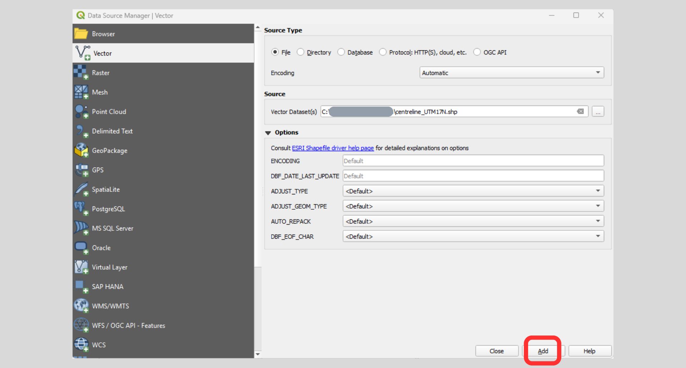
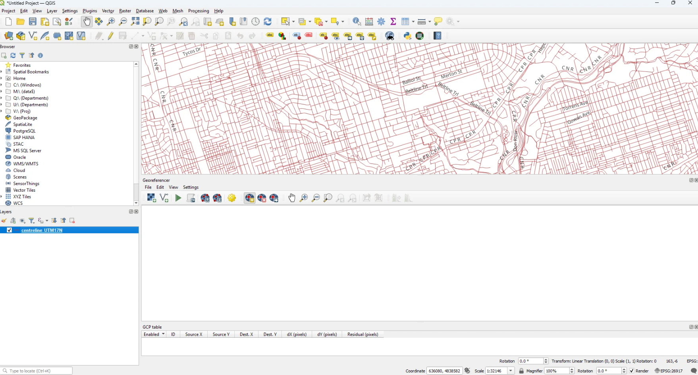

# **How to Georeference Images in QGIS**

This tutorial will explain how to georeference a raster image in QGIS so
it can be used as an overlay or for digitizing purposes.

**Table of Contents**

* [Introduction](#introduction)
* [Setting up Working Environment](#setting-up-working-environment)
  + [Download the Sample Data](#download-the-sample-data)
  + [Add the Street Layer to QGIS](#add-the-street-layer-to-qgis)
  + [Prepare the Raster Image outside QGIS](#prepare-the-raster-image-outside-qgis)
* [Georeferencer in QGIS](#georeferencer-in-qgis)
	+ [Start the Georeferencer Tool](#start-the-georeferencer-tool)
  + [Load the Scanned Map](#load-the-scanned-map-into-the-georeferencer)
* [Adding Control Points](#adding-control-points)
	+ [Get your Reference Area Ready](#get-your-reference-area-ready-in-the-map-canvas)
	+ [Add Additional Control Points](#add-additional-control-points)
  + [Edit Control Points](#edit-control-points-in-the-gcp-table)
* [Georeference and Check Visually](#georeference-and-check-visually)
  + [Optional: Clip Away the Black Border with a Mask Polygon](#optional-clip-away-the-black-border-with-a-mask-polygon)
* [Saving and Using the Georeferenced Raster](#saving-and-using-the-georeferenced-raster)

## Introduction

Georeferencing is the name given to the process of transforming a
scanned map or aerial photograph so it appears "in place" in GIS. By
associating features on the scanned image with real world x and y
coordinates, the software can progressively warp the image so it fits to
other spatial datasets. In this example, a historic Toronto map will be
georeferenced using a dataset of city streets so we can see what existed
on the site of Robarts Library before it was built.

## Setting up Working Environment

### Download the Sample Data

Georeferencing requires a spatially referenced dataset that will be used
to provide locations on the scanned map with their associated
coordinates. In this example, we will match intersections represented on
the scanned map with a shapefile of city streets.

Below is a link to the .zip file that will be used during this tutorial.
This file contains both the centreline_UTM17N.shp data file (showing
city streets) as well as the V2-1910-172.tif image file (a scanned map
of the block).

Please download and unzip the [sample
data](https://maps.library.utoronto.ca/docs/QGIS_Georeferencing_Tutorial_Files.zip)

### Add the Street Layer to QGIS

Open QGIS.

From the top menu, choose **Layer → Add Layer → Add Vector Layer**.

In the dialog, set **Source type** to "File". Under Source, click the
... to browse to centreline_UTM17N.shp, then click **Open → Add**. Then,
close the dialog.

To label streets, right‑click the centreline_UTM17N layer, choose
**Properties**, then go to the **Labels** tab. Select **"Single
Labels"** from the drop-down menu, and choose **LF_NAME** (the field
that contains street names), then click **OK**.

> 

### Prepare the Raster Image outside QGIS

Before adding the raster file (V2-1910-172.tif) to be georeferenced,
make sure to open it in an image viewer or editor (e.g. IrfanView or
Adobe Photoshop) to ensure there are no excess areas which can often
occur with scanned images. For best results, the image should be rotated
and cropped so it is oriented in the right direction and areas outside
the edge of the map sheet have been removed. The image used in this
tutorial (seen on the left, below) is ready to be georeferenced.

## Georeferencer in QGIS

### Start the Georeferencer Tool

QGIS handles georeferencing in a separate window called the
"Georeferencer". To open it:

Go to **Layer → Georeferencer...** in the main menu.

Optional: You can Dock the Georeferencer window if you like. In the
Georeferencer window, open **Settings → Configure Georeferencer...** and
check **Show georeferencer window docked**. Click **OK**.

The Georeferencer will appear docked at the bottom of the QGIS window.

### Load the Scanned Map into the Georeferencer

In the Georeferencer window, click the **Open Raster** icon on the
toolbar.

Browse to v2-1910-172.tif, select the file, and click **Open**.

The image will appear in the Georeferencer window but not yet in the
main map canvas.

Then, set up how QGIS will warp and save the raster:In the Georeferencer
window, click **Settings → Transformation settings...**.

Set the settings to the following:

1.  Set the **Transformation type** to a suitable method such as
    **Polynomial 1**.

2.  Set the **Target CRS** (coordinate reference system) to match the
    street layer, e.g. **EPSG:26917 -NAD83 / UTM Zone 17N**.

3.  Click the **...** button next to **Output file** and choose a
    filename and location for the georeferenced image (for example,
    V2-1910-172_geo.tif).

4.  Set **Resampling method** to **Nearest Neighbour**.

5.  Uncheck **Set target resolution**.

6.  Check **Save GCP points.**

7.  Check **Load in project when done.**

8.  Click **OK** to save.

## Adding Control Points

### Get your Reference Area Ready in the Map Canvas

Pan and Zoom to the Robarts area (Spadina, Bloor, St. George, Harbord)
so intersections are clearly visible and labels readable.

Set snapping to improve accuracy: Open **Project → Snapping
Options...**.

Click **Enable Snapping**.

Set the **Type** to **"Vertex"** and choose a small tolerance (for
example, 5 px). Then, close the dialog. This will help you snap your
control points exactly to road intersections in the vector layer when
you pick coordinates from the map.

### Add your first control point

Control points in QGIS link a location on the scanned image with its
real‑world coordinates from the map.

In the Georeferencer window, click the **Add GCP Point** tool on the
toolbar.

Zoom and click on a clearly identifiable street intersection on the
scanned map, such as the corner of Bloor West and St. George.

A dialog called **Enter Map Coordinates** will appear. In that dialog,
click the **From map canvas** button.

Zoom and pan so that the same intersection is visible, then **click
exactly on that intersection** on the centreline_UTM17N layer.

A green dot will appear on the point you clicked. The coordinates from
the map canvas will be filled into the dialog, then click **OK**.

The green dot will turn into red and your first control point is now
listed in the Georeferencer's GCP table.

### Add Additional Control Points

Repeat the same process for several more intersections, spreading them
across the map. Aim to include points near all four corners of the area
you want to georeference, plus a few in the middle.

> 

### Edit Control Points in the GCP Table

In the Georeferencer, you will see a table at the bottom listing each
Ground Control Point (GCP). If a point seems wrong, you can:

1.  Select that row, right-click, and press **Remove** to remove it, or

2.  Double‑click a coordinate value to edit it manually.

## Georeference and Check Visually

Once you have at least 3--4 well‑distributed control points, click
**Start Georeferencing** (green play button) in the Georeferencer.

You can toggle the visibility of the new georeferenced raster layer on
and off, and adjust its transparency by **right-clicking the
georeferenced layer** in the Layers Panel, select **Properties →
Transparency** to adjust transparency, then click OK. This allows you to
see how well streets and other features line up.

If the fit is not satisfactory, you can return to the Georeferencer,
refine or add more control points, and run **Start Georeferencing**
again until alignment improves.

### Optional: Clip Away the Black Border with a Mask Polygon

Sometimes the georeferenced raster appears rotated with a solid black
border. You can remove the black border for cleaner visualization if you
prefer.

Go to **Layer → Create Layer → New Temporary Scratch Layer**, Set the
**Geometry type** to **Polygon** and set the CRS to match the street
layer, e.g. **EPSG:26917 -NAD83 / UTM Zone 17N**. Then, click **OK**.

Select the new polygon layer, click **Toggle Editing**, then click **Add
Polygon Feature**.

Click around the edge of the raster image (just inside the black
collar).

**Right‑click** to finish and the polygon will turn into green. Then,
click **Toggle Editing** to **save** and turn it off.

Next, open **Raster → Extraction → Clip Raster by Mask Layer...**

Set the settings to the following:

1.  **Input layer**: the georeferenced raster, i.e. v2-1910-172_geo

2.  **Mask layer**: the polygon mask layer, i.e. New scratch layer

3.  Check **Create an output alpha band** and **Match the extent of the
    clipped raster to the extent of the mask layer**.

4.  Then, click **Run**.

You will get a new raster with the black border removed and transparency
outside the polygon

## Saving and Using the Georeferenced Raster

If you have checked **Save GCP points** in Transformation Settings, QGIS
writes a .points file that you can reload later.

If you would like to permanently save the georeferenced (or clipped)
raster, right‑click the layer, choose **Export → Save As...**, select
**Raw data**, set the format (**GeoTIFF**) and output location, and
click **OK**.

If you would like to save the project, click **Project → Save As...**.
Choose a filename and location for the QGIS project file, then click
**Save**.

